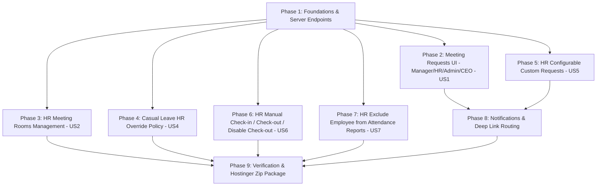

# Tasks: Meeting, Configurable Requests, HR Attendance Operations, and Attendance Exclusion

**Branch**: `010-meeting-custom-requests`  
**Spec**: [spec.md](spec.md) | **Plan**: [plan.md](plan.md)  
**Status**: Draft — Awaiting owner review

---

## Task Dependencies & Execution Order

---

## Phase 1: Foundations & Server-Authoritative Endpoints

Goal: Provide server endpoints, transactions, characterization tests, and backend modules for meeting requests, room availability, custom request types, casual leave overrides, manual attendance, and attendance reporting exclusion.

- [ ] T001 [P] Add characterization unit tests for casual leave auto-approval and attendance safeguards in `test/casual_leave_override_characterization_test.dart` and `test/attendance_manual_characterization_test.dart`
- [ ] T002 [P] Implement Node.js server modules for Meeting Requests (Manager, HR Admin/Staff, Super Admin, CEO recipients), Room Management, Configurable Requests, Casual Leave Override, and Attendance Exclusion in `scripts/meeting-requests.js`, `scripts/configurable-requests.js`, and `scripts/notification-web.js`
- [ ] T003 [P] Add Node integration tests in `scripts/test/meeting-requests.test.js` and `scripts/test/configurable-requests.test.js`

---

## Phase 2: User Story 1 — Meeting Request Submission & Recipient Approval Queue (Manager/HR/Admin/CEO) (P1)

Goal: Allow employees to select any active Manager, HR, Admin, or CEO recipient, room, and date/time; submit a meeting request; view history; and allow recipients to approve/reject meeting requests from their queue.

- [ ] T004 [P] [US1] Create Meeting Request domain entities and repository interface supporting Manager, HR, Admin, and CEO recipients in `lib/features/meeting_requests/domain/entities/meeting_request.dart` and `lib/features/meeting_requests/domain/repositories/meeting_requests_repository.dart`
- [ ] T005 [P] [US1] Implement Meeting Request data adapter calling Hostinger operations API in `lib/features/meeting_requests/data/meeting_requests_repository_impl.dart`
- [ ] T006 [US1] Create Meeting Request Cubits (`MeetingSubmissionCubit`, `MeetingApproverCubit`) in `lib/features/meeting_requests/presentation/cubit/`
- [ ] T007 [US1] Add visible Meeting Request entry button on `lib/screens/employee/employee_requests.dart` linking to `MeetingRequestPage`
- [ ] T008 [US1] Implement Approver Decision Queue Screen & Tab for Meeting Requests (for Manager, HR, Admin, and CEO accounts) in `lib/features/meeting_requests/presentation/pages/meeting_approver_queue_page.dart`
- [ ] T009 [US1] Build Meeting Request History & Cancellation UI in `lib/features/meeting_requests/presentation/pages/meeting_history_page.dart`

---

## Phase 3: User Story 2 — HR Meeting Rooms Management (P2)

Goal: Allow HR and Super Admin users to view, add, edit, and deactivate meeting locations (e.g. Office, Small Room, Large Room, custom rooms).

- [ ] T010 [P] [US2] Create Meeting Room domain entity and repository contract in `lib/features/meeting_requests/domain/entities/meeting_room.dart` and `lib/features/meeting_requests/domain/repositories/meeting_rooms_repository.dart`
- [ ] T011 [P] [US2] Implement Meeting Room data repository in `lib/features/meeting_requests/data/meeting_rooms_repository_impl.dart`
- [ ] T012 [US2] Create `MeetingRoomsCubit` in `lib/features/meeting_requests/presentation/cubit/meeting_rooms_cubit.dart`
- [ ] T013 [US2] Build HR Meeting Rooms Management Screen (view, add, edit, activate/deactivate rooms) in `lib/features/meeting_requests/presentation/pages/hr_meeting_rooms_page.dart` and add entry button on HR Dashboard

---

## Phase 4: User Story 4 — HR Casual Leave (الإجازة العارضة) Override Policy (P2)

Goal: Allow HR to override an automatically approved casual leave before its execution date with a mandatory reason, transitioning it to the review approval chain while preserving audit history.

- [ ] T014 [P] [US4] Add Casual Leave Override service method in `lib/services/leave_service.dart` to call Hostinger override endpoint
- [ ] T015 [US4] Build HR Casual Leave Override action sheet in `lib/screens/hr/casual_leave_override_sheet.dart` to change auto-approved leave to review-required state with employee notification

---

## Phase 5: User Story 5 — HR Configurable Request Types (أنواع الطلبات المخصصة) (P3)

Goal: Allow HR to define reusable custom request types (audience, custom fields, 1-4 stage approval route) and allow eligible employees to submit them and approvers to decide on them in order.

- [ ] T016 [P] [US5] Create Configurable Request domain entities and repository interface in `lib/features/configurable_requests/domain/`
- [ ] T017 [P] [US5] Implement Configurable Request data adapter in `lib/features/configurable_requests/data/configurable_requests_repository_impl.dart`
- [ ] T018 [US5] Create `ConfigurableRequestTypesCubit` and `ConfigurableSubmissionCubit` in `lib/features/configurable_requests/presentation/cubit/`
- [ ] T019 [US5] Build HR Request Types Management Screen (title, description, custom fields, audience selection, ordered approval chain) in `lib/features/configurable_requests/presentation/pages/hr_custom_request_types_page.dart`
- [ ] T020 [US5] Build Employee Custom Request List & Submission Form in `lib/features/configurable_requests/presentation/pages/employee_custom_request_submission_page.dart`
- [ ] T021 [US5] Build Approver Queue & History Screen for Custom Requests in `lib/features/configurable_requests/presentation/pages/custom_request_approver_queue_page.dart`

---

## Phase 6: User Story 6 — HR Manual Check-in, Check-out & Check-out Disable (P1)

Goal: Allow HR to record manual check-in, manual check-out, or disable sign-out requirement for current employees on an active session with required reason and notification.

- [ ] T022 [P] [US6] Extend HR Manual Attendance Gateway in `lib/services/dashboard_attendance_summary_service.dart` to support manual check-in, manual check-out, and disable check-out on active sessions
- [ ] T023 [US6] Update HR Dashboard Manual Attendance dialog/sheet in `lib/screens/hr/hr_dashboard.dart` to allow HR to perform manual check-in, manual check-out, or disable check-out with required reason and audit log

---

## Phase 7: User Story 7 — HR Employee Attendance Reporting Exclusion (P2)

Goal: Allow HR to exclude an employee account from "حالة حضور الشركة اليوم" counters and reports while keeping their account active for app login, requests, chat, and other features.

- [ ] T024 [P] [US7] Add `excludeFromAttendanceReports` property in `lib/models/user_model.dart` and `lib/services/auth_service.dart`
- [ ] T025 [US7] Update `lib/services/dashboard_attendance_summary_service.dart` and `lib/screens/hr/attendance_summary_details_screen.dart` to filter out excluded employees from company attendance summary counts and employee lists
- [ ] T026 [US7] Update `lib/screens/employee/employee_dashboard.dart` to disable check-in/out buttons with an Arabic message ("غير مطبق عليك تسجيل الحضور/الانصراف") when `excludeFromAttendanceReports: true`
- [ ] T027 [US7] Add HR toggle control for attendance reporting exclusion on `lib/screens/hr/employee_mgmt.dart`

---

## Phase 8: Notifications & Deep Link Routing

Goal: Ensure every approval turn, decision, cancellation, and HR override emits an in-app and push notification with exact deep linking.

- [ ] T028 [P] Update `lib/models/notification_route_policy.dart` and `lib/navigation/router.dart` for meeting requests and custom requests deep links and turn notifications

---

## Phase 9: Verification & Hostinger Deployment Package

Goal: Verify architecture rules, run all unit/Node tests, build release web app, and package updated Hostinger backend ZIP.

- [ ] T029 Run `flutter analyze`, `flutter test test/architecture_guard_test.dart test/firestore_query_guard_test.dart`, `flutter test`, and `(cd scripts && npm test)`
- [ ] T030 Package updated `hostinger_deploy.zip` containing new Node backend modules and build release web app
