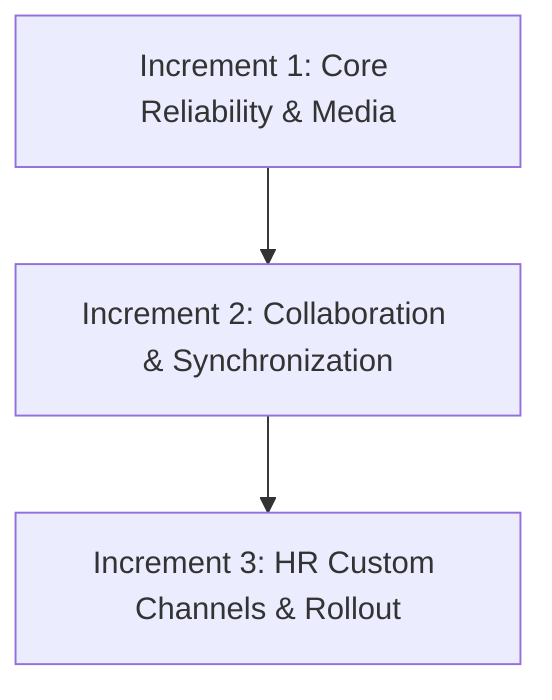

# Zawolf Chat Upgrade — Technical Implementation Plan

**Feature Boundary**: `lib/features/conversations/`, `scripts/conversations/`, `specs/conversations/`  
**Governing Documents**: `specs/conversations/spec.md`, `.specify/memory/constitution.md`  
**Status**: Approved Technical Plan  
**Rollout Flag**: `conversations_rich_chat_v1`

---

## 1. Architectural Foundation & Compatibility

### 1.1 Strangler Fig Delivery Beside Legacy Chat
The upgrade implements rich messaging as a parallel vertical slice beside the existing chat implementation:
- **Routing & Composition Root**: The GoRouter entry point evaluates `conversations_rich_chat_v1` inside [`RichConversationEntry`](file:///Users/seg/Shemais/Shemais/zawolf_hr/lib/navigation/rich_conversation_entry.dart). If disabled or unavailable, it transparently falls back to the legacy [`ConversationEntry`](file:///Users/seg/Shemais/Shemais/zawolf_hr/lib/navigation/conversation_entry.dart).
- **Additive Server Endpoints**: All new capabilities are routed under `/conversations/v2` in [`scripts/conversations/router.js`](file:///Users/seg/Shemais/Shemais/zawolf_hr/scripts/conversations/router.js), preserving existing legacy endpoints (`/conversations/messages`, `/conversations/attachments`) without regression.
- **Visual Identity & Rules**: Preserves Zawolf brand tokens, Arabic typography, and existing department/manager authorization checks.

### 1.2 Clean Architecture Layers
```text
lib/features/conversations/
  domain/
    entities/       # RichChannel, RichMessage, RichAttachment, ChatDraftFile, ReaderPosition
    repositories/   # RichChatRepository, ChatMediaGateway
    usecases/       # MessageDeliveryCoordinator
  data/
    local/          # ChatDatabase (Drift), ChatStore
    media/          # ChatMediaGatewayImpl, ChatRecorderImpl, LocalMedia
    chat_transport.dart
    rich_chat_repository_impl.dart
  presentation/
    cubit/          # ChatInboxCubit, ChatTimelineCubit, ChatComposerCubit, 
                    # ChatActionCubit, ChatRequestsCubit, ChatSearchCubit, 
                    # ChatMediaCubit, ChatUserPickerCubit, VoiceNoteCubit
    pages/          # RichChatInboxPage, RichChatPage, ChatRequestsPage, 
                    # ChatRequestFormPage, ChatSearchPage, ChatUserPickerPage
    widgets/        # RichChatComposer, ChatMessageBubble, RichAttachmentView, 
                    # VoiceNoteButton, ChatLinkPreviewView, ChatMessageActions
```
- **Layer Isolation**:
  - `presentation` depends strictly on domain contracts and presentation-safe utilities. Zero direct imports of Drift, Firestore, Drive, or HTTP transport.
  - `domain` is pure Dart with zero Flutter, UI, or infrastructure dependencies.
  - `data` implements domain repositories, encapsulating Drift, HTTP networking, and platform media adapters.
- **Cubit Complexity Cap**: Every Cubit is single-responsibility and strictly under 300 lines. Multi-step orchestration lives in application services / use cases ([`MessageDeliveryCoordinator`](file:///Users/seg/Shemais/Shemais/zawolf_hr/lib/features/conversations/domain/usecases/message_delivery.dart)).

### 1.3 Durable Feature-Owned Drift Database
- **Relational Persistence**: Messages, drafts, attachment files, read positions, and pending outbox mutations are stored in a dedicated Drift SQLite database ([`ChatDatabase`](file:///Users/seg/Shemais/Shemais/zawolf_hr/lib/features/conversations/data/local/chat_database.dart)).
- **Web Durability**: Configured explicitly with Drift's WebAssembly worker (`web/drift_worker.js`, `web/sqlite3.wasm`) using official Drift web guidelines. Storage quota exhaustion surfaces descriptive Arabic error banners rather than silently discarding drafts.
- **User Scoping**: Local database records are partitioned by the authenticated user UID to prevent data leakage across account switches.

---

## 2. Reliable Messages & Resumable Media Transfers

### 2.1 Outbox Pattern & Resilient Sending
1. **Pre-Send Persistence**: When the user taps send, the composer immediately commits:
   - The message payload with a UUIDv4 `operationId` into `LocalPendingOperations`.
   - Any attachment bytes and metadata into `LocalDraftFiles`.
   - Only after local storage confirmation is the UI composer cleared.
2. **Sequential Upload Queue**: The message send operation is paused in the local outbox until all attached files complete uploading.
3. **Idempotent Commit**: The server records processed `operationId` values in Firestore. Re-transmissions due to network timeouts replay the existing message receipt without duplicating messages.
4. **Offline & Restart Recovery**: If the application crashes, terminates, or loses connectivity, incomplete uploads and pending messages resume from the exact last saved offset upon app restart.
5. **No Synthetic Text**: Empty captions are permitted when attachments are present. The legacy synthetic `مرفق` string is suppressed from new sends and masked when displaying historical attachment records.

### 2.2 Chunked Resumable Transfers & Drive Integration
- **Server-Managed Drive Storage**: Attachments are stored in Google Drive within protected corporate folders managed by Hostinger backend service credentials. No public Drive URLs, bearer tokens, or raw Drive file IDs are exposed to clients.
- **Resumable Transfer Protocol**:
  - `POST /conversations/v2/channels/{id}/uploads`: Declares `fileName`, `mimeType`, `sizeBytes`, `kind`. Server generates a unique `resourceId`, pre-generates a Google Drive file ID, and returns initial offset `0`.
  - `PUT /conversations/v2/channels/{id}/uploads/{resourceId}`: Transfers sequential 1 MiB binary chunks with `X-Upload-Offset` and `X-Operation-Id` headers.
  - `POST /conversations/v2/channels/{id}/uploads/{resourceId}/finalize`: Verifies total bytes received against declared size, finalizes the Drive file, and returns the verified `RichAttachment` descriptor.
  - `GET /conversations/v2/channels/{id}/uploads/{resourceId}`: Recovers current upload offset after connection dropouts.
- **Constraints**: 25 MiB maximum per file; maximum 10 attachments per message.
- **Protected Download**: `GET /conversations/v2/channels/{id}/attachments/{resourceId}/download` verifies channel membership and streams authenticated bytes with proper `Content-Type` and UTF-8 `Content-Disposition`.
- **Media Previews & Native Sharing**:
  - Images display at uncropped native aspect ratio. Tapping opens fullscreen zoom/pan viewer with save (`file_picker`), clipboard copy (`super_clipboard`), and system share (`share_plus`).
  - Unsupported document formats display structured file cards with name, type, and size; preview failures never prevent file download.

### 2.3 Audio & Video Recording and Playback
- **Voice Notes**: Uses `record: ^6.2.1` via `ChatRecorderImpl`. Records 16 kHz mono 16-bit PCM WAV (`audio/wav`) for universal cross-platform native and web browser playback without server transcoding. Enforces a 300-second hardware cutoff with live waveform/timer preview, pause, cancel, and playback.
- **Video Playback**: Uses `video_player` with on-demand initialization, first-frame preview thumbnail, play/pause, scrub bar, and fullscreen view.

---

## 3. Messaging Features & Lifecycle Synchronization

### 3.1 Advanced Message Primitives
- **Replies**: Messages reference `replyToMessageId`. Timelines render a quoted preview bubble; tapping scrolls smoothly to the parent message.
- **Reactions**: Single toggleable reaction per user per message stored in `/conversations/{id}/messages/{messageId}` under `reactions.{userId} = emoji`. Selecting the same emoji removes it; selecting another replaces it.
- **Forwarding**: User can forward messages to any authorized channel where they have posting privileges. Attachments are re-linked under destination-scoped resource references after verifying destination permissions.
- **Sender Editing & Deletion**:
  - Permitted strictly within 15 minutes of server `sentAt` timestamp.
  - Requires matching `expectedRevision` to prevent concurrent overwrite collisions.
  - Deletion replaces message body with tombstone (`تم حذف هذه الرسالة`) and sets `deletedAt`.
  - Historical text revisions and deleted contents are preserved in `/audit` for HR compliance inspection.

### 3.2 Read Receipts & Presence
- **Delivery States**: Optimistic (`pending`), server accepted (`sent`), recipient read (`seen`).
- **Foreground Seen Reporting**: Read positions are reported to `/conversations/v2/channels/{id}/read` only when messages are rendered inside an active, foreground route. Nonmember HR inspection never advances read marks.
- **Typing Indicators**: Expire automatically after 10 seconds; outbound typing pings are throttled to at most once per 5 seconds.

### 3.3 Efficient Lifecycle Synchronization
- **Bounded History Pages**: Initial channel history loads 50 messages using `before={cursor}`.
- **Monotonic Incremental Changes**: Active channels poll `/conversations/v2/channels/{id}/changes?after={changeCursor}&limit=100` every 3 seconds, fetching edits, deletions, reactions, and reader positions in unified batches.
- **Inbox Polling**: Unopened channels poll at 15-second intervals.
- **Lifecycle Awareness**: Polling pauses completely when the app is backgrounded or minimized, resuming immediately upon foregrounding with exponential backoff on network errors.

### 3.4 Search & Public Link Previews
- **Bounded Channel Search**: Searches channel messages up to 200 rows per request with diacritic-insensitive Arabic and case-insensitive English matching. Offline search transparently searches local Drift records with a visible scope notice.
- **SSRF-Protected Link Previews**: Generated via `/conversations/v2/channels/{id}/preview`. Blocks loopback, private RFC-1918, RFC-4193, and cloud metadata addresses (`169.254.169.254`). Enforces 3-second timeout and 512 KiB body limits.

---

## 4. Custom Channel Requests & HR Review Queue

### 4.1 Request Proposal Flow
1. Employee initiates request with channel name, business justification, and 1–99 active colleagues selected from `/conversations/v2/users` (2–100 total members including requester).
2. Saved as `pending` under `/channel_requests`.

### 4.2 HR Review Queue & Atomic Approval
1. HR administrators (validated via canonical authorization helper `isHrOrAdmin`) view the centralized request queue.
2. HR can modify proposed channel name or adjust member list prior to decision.
3. Decision is submitted with `expectedRevision` to `/requests/{id}/review`:
   - **Approval**: Transactionally updates request status to `approved`, creates the channel under `/conversations`, assigns members, links `conversationId`, and dispatches notifications. Repeated or concurrent approvals return the existing channel idempotently.
   - **Rejection**: Requires mandatory Arabic rejection reason; updates status to `rejected`.
4. Nonmember HR administrators have read-only inspection access to approved custom channels with explicit UI disclosure.

---

## 5. Phased Increments & Delivery Strategy

The upgrade will be delivered in 3 independently testable increments:



### Increment 1: Core Reliability & Media
- Feature-owned Drift database schema & local outbox.
- 1 MiB chunked resumable Drive transfers up to 25 MiB.
- Full-aspect uncropped image viewing, fullscreen zoom, copy/save/share.
- Native voice notes (16 kHz mono WAV, 300s limit) and on-demand video player.

### Increment 2: Collaboration & Synchronization
- Thread replies, single-reaction toggling, and destination-authorized forwarding.
- Sender-only 15-minute edit/delete window with tombstones and HR audit log.
- 50-message history paging and 100-event monotonic change synchronization.
- Read receipts, foreground seen tracking, unread counts, and throttled typing indicators.
- Bounded Arabic/English search and SSRF-safe link previews.

### Increment 3: HR Custom Channels & Rollout
- Employee custom channel request form with active user directory picker.
- HR review queue with member adjustments and transactional approve/reject.
- Nonmember HR audit inspection with clear UI disclosure.
- Integration behind `conversations_rich_chat_v1` rollout flag with instant fail-closed rollback.

---

## 6. Verification and Acceptance Gates

Every increment must pass all repository checks before sign-off:
1. `flutter analyze` — zero errors, zero warnings.
2. `flutter test test/architecture_guard_test.dart test/firestore_query_guard_test.dart` — strict architecture and query budget enforcement.
3. `flutter test test/features/conversations/` — feature unit, outbox, and widget tests.
4. `flutter test` — complete repository Flutter suite.
5. `(cd scripts && npm test)` — complete Hostinger server test suite.
